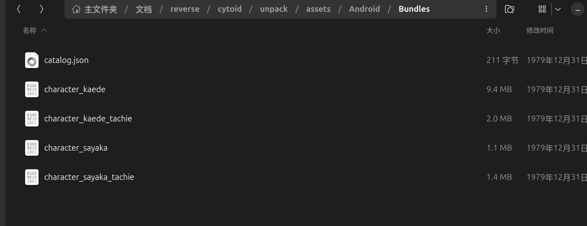
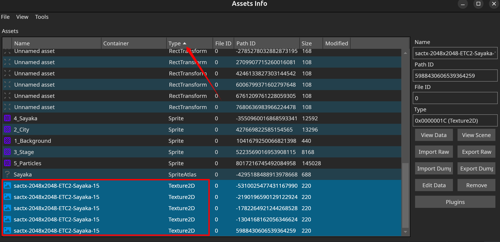
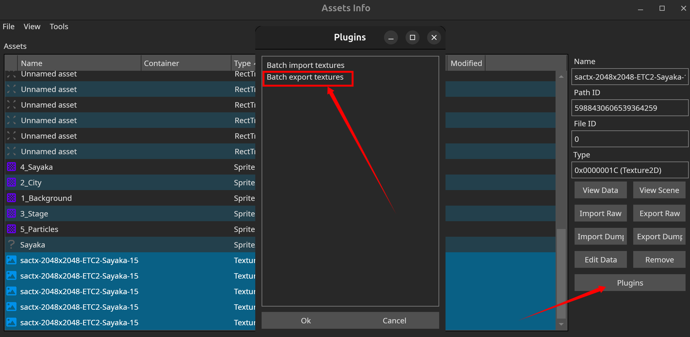
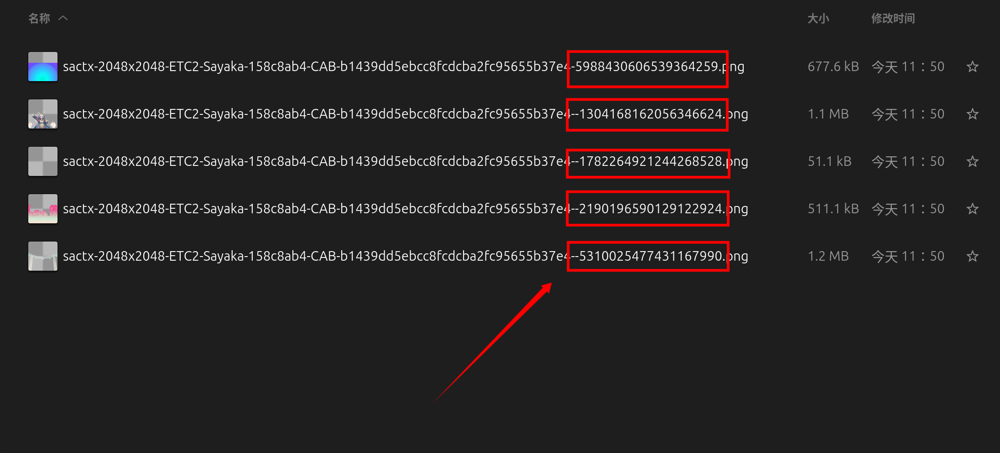
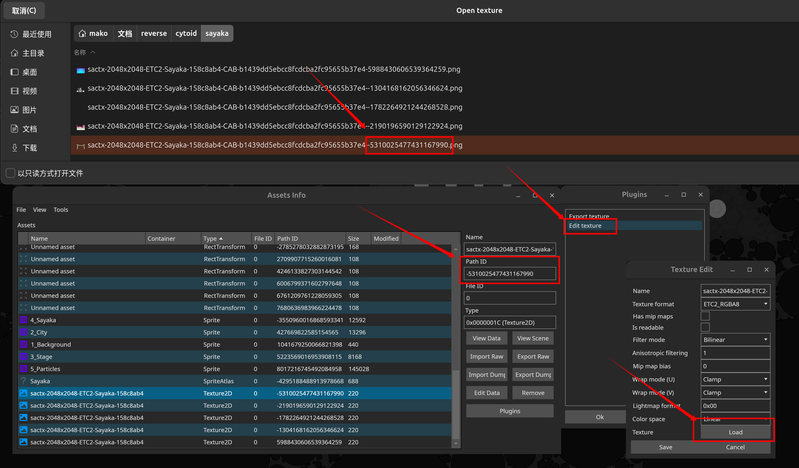

# **Cytoid 角色修改教程**

## **1. 软件准备**
- 一个Unity Bundle修改器：[UABEAvalonia](https://github.com/nesrak1/UABEA)
- 图片处理工具：[Photoshop](https://pan.baidu.com/s/1NzZCXnoSt59dKmCGG4hXNQ?pwd=fnhy)
- 解压软件：[7-zip](https://7-zip.org)
- APK 签名工具：[MT管理器](https://mt2.cn)

## **2. 处理 APK**
1. 下载Cytoid安装包，右键菜单选中`7-zip`提取，将其解压至一个你能找到的路径
2. 按照路径`解压路径\assets\Android\Bundles`找到文件`character_sayaka`

## **3. 导出资源**
1. 进入`UABEAvalonia`，使用组合键`Ctrl + O`打开文件`character_sayaka`, 接着选择`Memory`(解压至内存)
2. 点击`Info`（不要选择后缀为`.resS`的文件）进入详情，接着点击`Types`进行整理，拖到下面选中类型为`Texture2D`的文件

3. 点击右侧的`Plugins`，选择`Batch export textures`，接着选择`PNG`格式导出

4. 导出后的图片文件名中包含`PathID`，这是定位资源位置的唯一办法

## **4. 处理图片**
自行使用`Photoshop`修改图片，注意分辨率应为`2048x2048`，且角色位置需与原图完全一致，否则会出现问题

## **5. 写回 Bundle**
1. 确认要修改的图片的`PathID`，并在`UABEAvalonia`中找到该`PathID`的`Texture2D`资源，选中该资源，点击`Plugins`，接着点击`Edit texture`，在弹出的窗口中找到`Load`按钮，选择`PathID`相同的图片导入（你也可以选择任意2048x2048的图片，只需要保证自己清楚当前在修改哪张图片）

2. 图片选择完成后，单击`Save`，回到`Assets Info`窗口后使用组合键`Ctrl + S`保存资源修改，关闭`Assets Info`窗口回到`UABEA`窗口后再使用组合键`Ctrl + S`保存一次数据，保存完成后查看文件修改日期是否变化以确认修改是否成功

## **6. 写回 APK**
1. 使用修改后的`character_sayaka`文件替换apk中相同路径的文件`/assets/Android/Bundles/character_sayaka`，将修改后的apk传回手机进行签名处理（建议使用数据线而不是QQ，防止找不到文件）
2. 启动`MT管理器`，找到刚刚传入手机的apk，点击apk文件，接着点击左下角的`功能`按钮，然后选择左上角的`APK签名`功能，最后点击确定即可成功签名

## **7. 安装**
**安装应用即大功告成！**

## **常见问题**
1. `闪退`是Cytoid本身的问题，并不是由于修改资源，一般来说多进两次即可
2. `修改后的角色位置不对`是因为你修改后的图片中角色所在的位置不对，强烈建议先处理好自己的角色图片（删除背景等），然后打开导出的原图，将自己的角色贴在原图角色所在的位置，最后删除原图的角色
3. `带有tachie后缀的bundle`是游戏结算立绘，你也可以修改游戏结算立绘，修改方式与主界面立绘相同